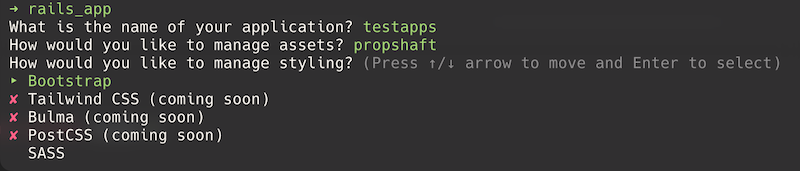

[](https://github.com/eclectic-coding/rails_app/actions/workflows/ci.yml)
# RailsApp

RailsApp is a gem that provides a simple way to create a new Rails application with a pre-configured set of gems and settings, utilizing the Rails application templates feature.

The initial release of this gem is an opinionated template that includes the following dependencies and settings:
- Esbuild for JavaScript bundling
- Bootstrap for CSS styling
- RSpec for testing
- Code quality tools: RuboCop, Brakeman, and Bundler Audit

The initial release of this gem **v.0.1.0** is starting with my personal preferences and a Rails template I have developed locally. I plan to expand the template to include more options and configurations with future releases which will make this template less opinionated.

## Installation
Install globally:
```bash
gem install rails_app
```

## Usage
To bootstrap a new Rails application: `rails_app`

The user will be prompted to enter the name of the new Rails application, and the select the assets pipeline to use (propshaft or sprockets), and a styling option:



The template will then create a new Rails application with the selected options.

### Testing
The template includes RSpec for testing, which includes pre configured:
- FactoryBot
- Faker
- Webmock
- VCR
- Simplecov

### Code Quality Tools
The template includes the following code quality tools:
- Rubocop using the `rubocop-rails-omakase` gem with a few custom settings in a provided `.rubocop.yml`
- Brakeman for security scanning
- Bundler Audit for checking for vulnerable gems

All of this tools can be run using the following command, which also will run the test suite: `bin/ci`

## Development

After checking out the repo, run `bin/setup` to install dependencies. Then, run `rake spec` to run the tests. You can also run `bin/console` for an interactive prompt that will allow you to experiment.

To install this gem onto your local machine, run `bundle exec rake install`. To release a new version, update the version number in `version.rb`, and then run `bundle exec rake release`, which will create a git tag for the version, push git commits and the created tag, and push the `.gem` file to [rubygems.org](https://rubygems.org).

## Contributing

Bug reports and pull requests are welcome on GitHub at https://github.com/eclectic-coding/rails_app.

## License

The gem is available as open source under the terms of the [MIT License](https://opensource.org/licenses/MIT).
